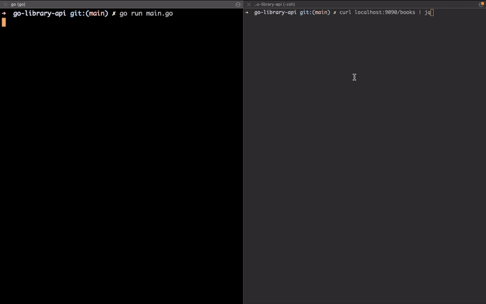

## go-library-api
The standard library in go comes with the net/http package, which is an excellent starting point for building RestAPIs.
This is a small API designed to manage books in a library.
Interaction with the server is carried out through curl
### How to use it
**To launch the server:**
```
go run main.go
```
### Example

### Implemented commands
| command | example | description |
|---|---|---|
| getBooks | curl localhost:9090/books | Prints a list of books and information about them to the terminal |
| updateBook | curl localhost:9090/books/{id} -X PUT '{new information}' | Updates information about an existing book
| addBook | curl localhost:9090/books -X POST '{new information}'' | Adds a new book to the library